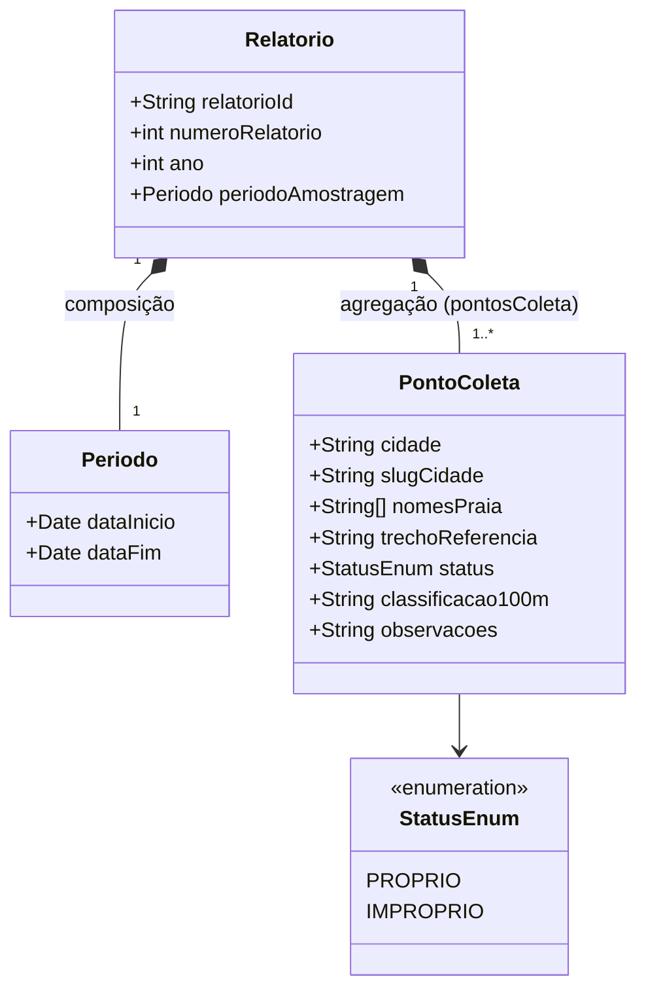

# Marco C2 - Modelo Conceitual UML + Mapeamento para MongoDB

## 5. Modelo Conceitual (UML)

### Diagrama de Classes

### Exemplos de propriedades exigidas

| Tipo de propriedade | Atributo | Classe | Justificativa |
|---|---|---|---|
| Simples | relatorioId (String) | Relatorio | Valor atômico, identificador derivado do nome do arquivo |
| Multivalorada | nomesPraia (String[]) | PontoColeta | Uma mesma linha pode agrupar mais de uma praia (ex.: "MANAÍRA E TAMBAÚ") |
| Composta | periodoAmostragem (objeto Periodo, com dataInicio e dataFim) | Relatorio | Atributo formado por subatributos com significado próprio |
| Opcional | observacoes (String) | PontoColeta | Só existe quando o status é IMPRÓPRIO (recomendação de evitar banho em 100 metros) |

### Relacionamento de agregação/composição

A relação entre Relatorio e Periodo é de composição, pois o período de amostragem não tem existência própria fora do relatório que o contém. É parte indissociável do documento.

A relação entre Relatorio e PontoColeta é de agregação, com multiplicidade 1 para 1..*. Cada edição semanal forma um agregado natural, em que os metadados da rodada e o conjunto de pontos de coleta são sempre lidos juntos nas análises (status por trecho, evolução semanal, distribuição de pontos próprios e impróprios).

Não há associação por referência no domínio, pois não existe entidade externa consultada separadamente. Todas as informações de uma edição são autocontidas no documento do relatório.

---

## 6. Projeto do Banco Orientado a Documentos (Mapeamento)

### Quadro A — Correspondência conceito ↔ dado coletado

| Classe / Propriedade (modelo) | Metadado na fonte (CSV/PDF) | Tipo geral |
|---|---|---|
| Relatorio.relatorioId | Derivado do nome do arquivo (ex.: relatorio-21-2026) | String |
| Relatorio.numeroRelatorio | "Número do relatório" extraído do título da página | Integer |
| Relatorio.ano | "Ano" extraído do título da página | Integer |
| Relatorio.periodoAmostragem.dataInicio | "Período de Amostragem" (data inicial parseada) | Date |
| Relatorio.periodoAmostragem.dataFim | "Período de Amostragem" (data final parseada) | Date |
| PontoColeta.cidade | "Cidade" | String |
| PontoColeta.slugCidade | Derivado/normalizado de "Cidade" | String |
| PontoColeta.nomesPraia | "Nome da Praia" (separado quando há "E" ou vírgula) | Array |
| PontoColeta.trechoReferencia | "Trecho / Ponto de Referência" | String |
| PontoColeta.status | "Status" (PRÓPRIO / IMPRÓPRIO) | String (enum) |
| PontoColeta.classificacao100m | "Classificação dos 100m" | String |
| PontoColeta.observacoes | Texto de aviso quando IMPRÓPRIO | String (opcional) |

### Quadro B — Mapeamento para o MongoDB

| Elemento (modelo) | Tipo no MC | Implementação no MongoDB | Observação |
|---|---|---|---|
| Relatorio | Classe | Coleção relatorios | Coleção principal, um documento por edição semanal |
| relatorioId | Atributo simples | Campo simples (String, indexado) | Identificador único da edição |
| numeroRelatorio, ano | Atributo simples | Campos simples (Integer) | Usados em filtros e ordenação temporal |
| periodoAmostragem | Composto | Documento embutido com dataInicio e dataFim | Subdocumento sem coleção própria |
| pontosColeta | Multivalorado / Agregação | Array de documentos embutidos | Lido sempre junto com o relatório |
| nomesPraia | Multivalorado | Array de Strings dentro de cada item de pontosColeta | Permite múltiplas praias por ponto |
| status | Enum | Campo simples (String) | Valores controlados: "PROPRIO" / "IMPROPRIO" |
| observacoes | Opcional | Campo simples, ausente quando status = PROPRIO | Campo opcional conforme exigido |
| slugCidade | Atributo derivado | Campo simples (String) | Calculado na camada gold (C3) para filtros |

### Decisão Embedding × Referência

Optou-se por embedding total de PontoColeta dentro de Relatorio, no array pontosColeta.

Quanto ao padrão de acesso, todas as perguntas de negócio definidas na Seção 4 operam sobre o conjunto de pontos de uma edição como uma unidade, com leitura conjunta do relatório e seus pontos.

Quanto à cardinalidade, cada relatório possui em torno de 40 a 60 pontos de coleta, um número pequeno e estável.

Quanto ao limite de 16 MB do BSON, o volume de dados de uma edição é da ordem de dezenas de KB, muito distante do limite.

Quanto à frequência de leitura conjunta, consultas como pontos impróprios na rodada mais recente ou evolução semanal por município exigem o relatório completo com seus pontos, usando $unwind e $match.

Quanto ao crescimento do relacionamento, o array cresce apenas até o número de pontos monitorados pela SUDEMA em cada edição, que é fixo por relatório. Cada nova edição gera um novo documento, e não um acréscimo ao array de um documento existente.

Não há relacionamentos por referência neste domínio, pois não existem entidades externas consultadas separadamente. Toda a informação relevante de uma edição é autocontida no próprio documento do relatório.